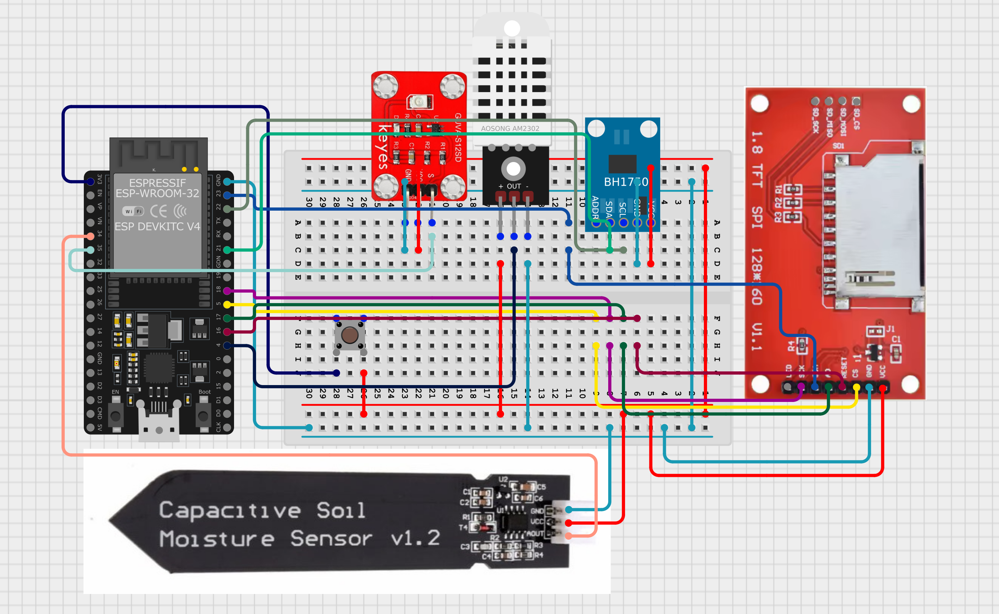

# Running small neural networks on esp32

Hey there, I am testing with esp32 GUI, Animations, Analysis and Sensors here.

My current build includes: 

#### Esp32 WROOM 32 Dev Kit

* 1.8" TFT Display	
* Capacitive Soil Moisture Sensor
* DHT22 Sensor	
* BH1750 Light Sensor
* GUVA-S12SD UV	Sensor

Will be training a small Neural-Net for performing predictions and analysis on the data collected by the sensors.

Here is the circuit diagram:

---
